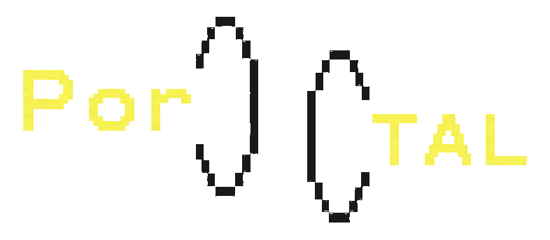

# PorTAL: Portable Task Adapters for LLMs

<p align="center">
  <picture>
    <source media="(prefers-color-scheme: dark)" srcset="docs/assets/portal_header_dark.png">
    <source media="(prefers-color-scheme: light)" srcset="docs/assets/portal_header_light_v2.png">
    
  </picture>
</p>

> Alpha research release [announced by Ramp Labs](https://x.com/RampLabs/status/2072381992285647280).
> APIs and artifact schemas may evolve before the first stable release.

PorTAL learns a base-agnostic task latent and a light per-base decoder that generates ordinary
per-layer LoRA weights. A task can be trained once, adapted to supported frozen base models, and
exported as a standard Hugging Face PEFT adapter.

`portallib` is an alpha Python library for loading, training, saving, publishing, and exporting
PorTAL artifacts with standard PyTorch and Hugging Face interfaces.


During source training, PorTAL jointly learns the task-latent table, one shared canonical core, and
one alignment for each source base. To port the learned tasks, it freezes the latent table and core
and refits only a fresh alignment for the target base. The resulting task adapter is exportable as
an ordinary PEFT LoRA adapter.

## Install

Install the inference library from a checkout:

```bash
pip install -e .
```

Install the optional Hugging Face model and dataset dependencies for training:

```bash
pip install -e '.[training]'
```

## Load and export

Load a native PorTAL artifact, select a trained task, and obtain a normal PEFT model:

```python
from transformers import AutoModelForCausalLM
from portallib import PortalModel

base = AutoModelForCausalLM.from_pretrained("Qwen/Qwen3-4B")
portal = PortalModel.from_pretrained("./portal-qwen3-4b", base_model=base)
model = portal.get_peft_model("rte")
model.save_pretrained("./portal-rte-qwen3-4b")
```

A task can also be exported without loading the base LLM:

```python
portal.export_peft("rte", "./portal-rte-qwen3-4b")
```

The exported directory is an ordinary PEFT adapter and reloads with
`PeftModel.from_pretrained`.

## Train an artifact

[`examples/train_example.py`](examples/train_example.py) is thin orchestration around the public
canonical trainer APIs. It freezes each base model, jointly learns shared task latents and a canonical
core with one thin alignment per source base, evaluates epoch zero and every training epoch, restores
the best held-out epoch, and writes one native artifact per base. Every source epoch draws a fresh
deterministic, task-balanced subset of up to 2,000 examples from the full pool. Validation uses up to
1,000 examples per task, and all five epochs run before the best-accuracy checkpoint is restored.
Both phases report material per-task regressions from epoch zero.

```bash
python examples/train_example.py \
  --dataset RampPublic/portallib-tasks \
  --dataset-revision 3f0a5e6e028a56cf6029bb4761df97d0ff36731d \
  --output portal-example
```

Repeat `--base-model` to share the task-latent table and canonical core across source bases.
`--refit-base-model` freezes both and fits only a fresh target-base linear alignment:

```bash
python examples/train_example.py --dataset tasks.json --output portal-qwen \
  --base-model Qwen/Qwen3-1.7B --base-model Qwen/Qwen3-4B \
  --refit-base-model Qwen/Qwen3-8B
```

Multiple source bases do not require a refit target. Without `--refit-base-model`, the example saves
one base-specific source artifact per model under `source-<model>` while retaining the identical
shared task latents and canonical core in each artifact:

```bash
python examples/train_example.py --dataset tasks.json --output portal-sources \
  --base-model Qwen/Qwen3-1.7B --base-model Qwen/Qwen3-4B
```

The output directory contains the best-epoch source artifacts and the best-epoch refitted artifact.

[`REPRODUCING.md`](REPRODUCING.md) records pinned dataset and model revisions, the complete training
configuration, checkpoint selection, and source/Qwen/Gemma recipes.

### Prepare the canonical task data

[`examples/prepare_dataset.py`](examples/prepare_dataset.py) downloads pinned revisions of the 14
upstream benchmark datasets and reproduces the exact prompt and choice normalization used by the
training examples:

```bash
python examples/prepare_dataset.py --output portal_tasks.json
python examples/train_example.py --dataset portal_tasks.json --output portal-example
```

Pass `--tasks rte,boolq` to prepare a smaller subset. The preparation script only writes locally by
default. Uploading the normalized dataset is a separate explicit operation:

```bash
python examples/prepare_dataset.py --output portal_tasks.json \
  --push-to-hub your-namespace/portal-tasks --private
```

Review the terms of every selected upstream dataset before redistributing normalized rows. The
canonical suite contains datasets under multiple licenses; portallib's Apache-2.0 license applies to
the software, not to upstream benchmark data. The upload command also installs the reviewed
[`examples/portal_tasks_dataset_card.md`](examples/portal_tasks_dataset_card.md) as the Hub dataset
card so its source revisions, split construction, and mixed licensing remain attached to the data.

For a cross-family Gemma 3 refit, provide Gemma's exact text decoder-layer path:

```bash
python examples/train_example.py --dataset tasks.json --output portal-gemma3 \
  --base-model Qwen/Qwen3-1.7B --base-model Qwen/Qwen3-4B \
  --refit-base-model google/gemma-3-4b-pt \
  --refit-layer-path model.language_model.layers \
  --refit-max-train 2000 --epochs 5
```

Use repeated `--base-layer-path` values when a source model does not expose its decoder at the
default exact path, `model.layers`. Paths are explicit rather than inferred from module-name
patterns, so an incompatible model fails before training.

The input is either a local JSON file or a Hugging Face dataset repository with `train` and
`validation` splits. Every row uses this schema:

```json
{
  "task": "rte",
  "prompt": "Premise: ...\nHypothesis: ...\nEntailment?",
  "choices": [" yes", " no"],
  "gold_idx": 0
}
```

A local JSON file wraps those rows in `train` and `validation` arrays. Normalized local data can be
uploaded explicitly when desired:

```bash
python examples/train_example.py --dataset tasks.json --output portal-example \
  --push-dataset-to namespace/portal-tasks --private-dataset
```

No dataset is uploaded unless `--push-dataset-to` is provided.

`--modules qv` generates LoRA for query/value projections. `--modules full` covers query, key,
value, attention output, gate, up, and down projections, including the MLP projections. In both
cases, the base model parameters remain frozen.

## Model compatibility

PorTAL supports Qwen3 and cross-family refitting to Gemma 3. Qwen3 exposes decoder layers at
`model.layers`; Gemma 3 exposes its text decoder at
`model.language_model.layers`. The default projection paths cover the usual query, key, value,
attention-output, and gated-MLP linear modules used by those families.

Other causal language-model families are expected to work when they expose uniform linear
projections across decoder layers. Pass their exact layer and projection paths through `PortalBase`;
PorTAL validates every configured path and dimension before training. Automatic architecture
adapters and models with non-uniform per-layer projection dimensions are not yet part of the
supported v0.1 compatibility surface. Contributions that add exact, tested architecture mappings
are welcome.

## Artifact format

Native artifacts use the standard Hugging Face layout:

- `config.json` contains the schema version, base model and revision, task names, LoRA settings,
  exact layer/module paths, and projection dimensions.
- `model.safetensors` contains `task_latents`, the canonical `core`, and one base-specific
  `alignment`, with `portallib` format metadata.
- `README.md` is the generated model card.

`PortalModel` inherits `ModelHubMixin`, so `save_pretrained`, `from_pretrained`, and `push_to_hub`
follow standard Hugging Face Hub behavior:

```python
portal.push_to_hub("namespace/portal-qwen3-4b", private=True)
```

Configured layers and projections are resolved deterministically. Missing modules, incompatible
dimensions, unknown schema versions, and inconsistent target declarations fail explicitly.

## Public API

- `PortalConfig` validates artifacts and builds exact configurations from supported base models.
- `PortalCoreTrainer` jointly trains shared latents/core and one alignment per source base using
  balanced per-task updates, EMA loss normalization, and per-base latent-gradient balancing.
- `PortalAdapterRefitter` freezes a source artifact's latents/core and trains only a target alignment.
- `PortalEvaluator` reports character-normalized multiple-choice accuracy and token-mean gold NLL.
- `PortalDecoder` combines a canonical core and one base-specific alignment to generate LoRA factors.
- `PortalModel` loads, saves, publishes, materializes, and exports trained artifacts.
- `ChoiceDataset` loads the normalized local/Hub task schema and supports explicit Hub upload.

## Development

```bash
uv run ruff check src tests examples
uv run pytest -q
uv run python -m build
```

PorTAL is licensed under Apache-2.0.

## Citation

If you use PorTAL, cite the software metadata in [`CITATION.cff`](CITATION.cff).
